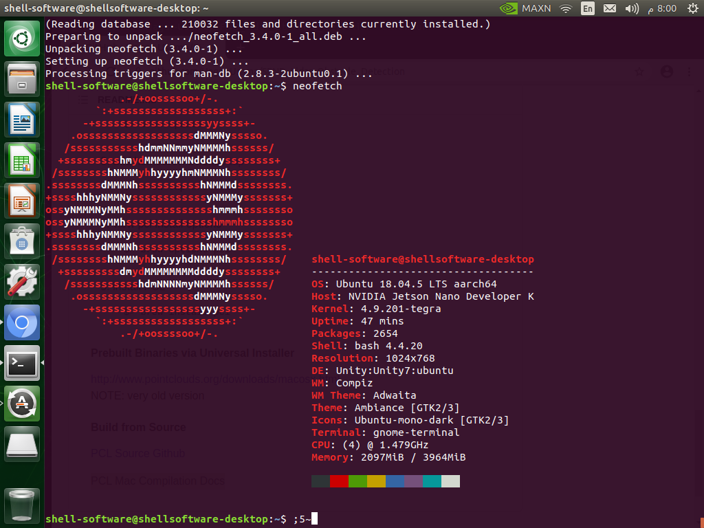

# Dependencies (Grad Project)
---

## Getting Started

Firstly, I installed `neofetch` to check the specifications of my micro-computer.

{ loading=lazy }

## Other Dependencies

### PCL

`sudo apt install libpcl-dev`

### Python 3

`sudo apt install python3.7-dev`

### OpenCV

Best explanation ever is available [here](https://github.com/udacity/SFND_2D_Feature_Tracking/issues/3)

1. If you have not installed OpenCV, follow the below steps
   ```python

   git clone https://github.com/opencv/opencv.git
   cd opencv
   git checkout 4.1.0
   cd .. #get out of opencv folder
   ```
2. now get opencv_contrib
   ``` python
   git clone https://github.com/opencv/opencv_contrib/
   git checkout 4.1.0
   cd .. #get out of opencv_contrib folder
   ```
3. let's create a build directory inside opencv folder and install opencv where we will refer opencv_contrib
   ```python
   cd opencv
   mkdir build && cd build
   cmake -D CMAKE_BUILD_TYPE=RELEASE -D OPENCV_ENABLE_NONFREE=ON -D OPENCV_EXTRA_MODULES_PATH=../../opencv_contrib/modules -D WITH_GTK=ON ..
   make && sudo make install
   ```

???+ Info
    The setup process may take a long time (over 3 hours). If necessary, you may need to reboot the device and restart the setup. The installation of OpenCV may take a considerable amount of time, potentially exceeding 2 hours.

<br>

{ loading=lazy }


### g++ (already installed)

`sudo apt-get install g++`

### cmake
`sudo snap install cmake -classic`

### net-tools (already installed)
`sudo apt-get install -y net-tools`

### Docker (already installed)
`sudo apt install docker.io`


### ROS II Foxy


???+ Warning
    ROS II Foxy requires Ubuntu 20 as the minimum operating system version. As we are currently using Ubuntu 18 (as checked with neofetch), we will need to install ROS II Foxy using Docker.


{ loading=lazy }


`docker run -it ros:foxy`


???+ Tip
    Please check ROS official [website](https://discourse.ros.org/t/announcing-ros-foxy-docker-images-availability/14511) for further inforamation
