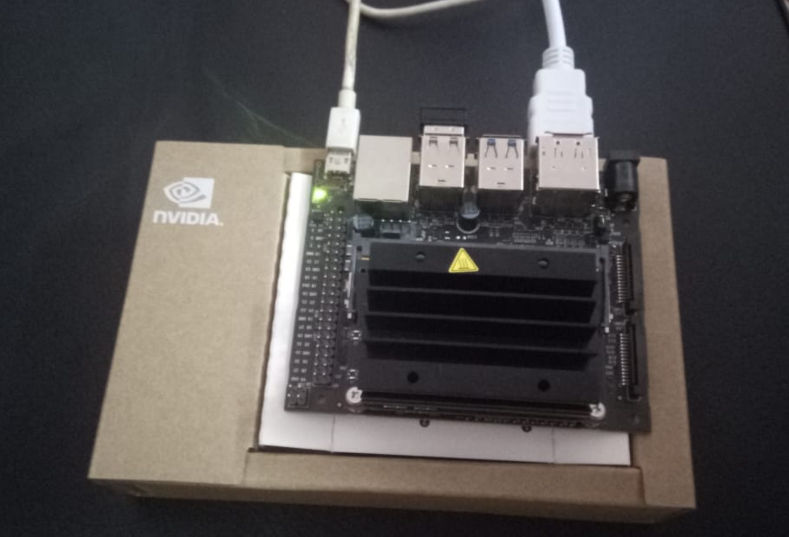
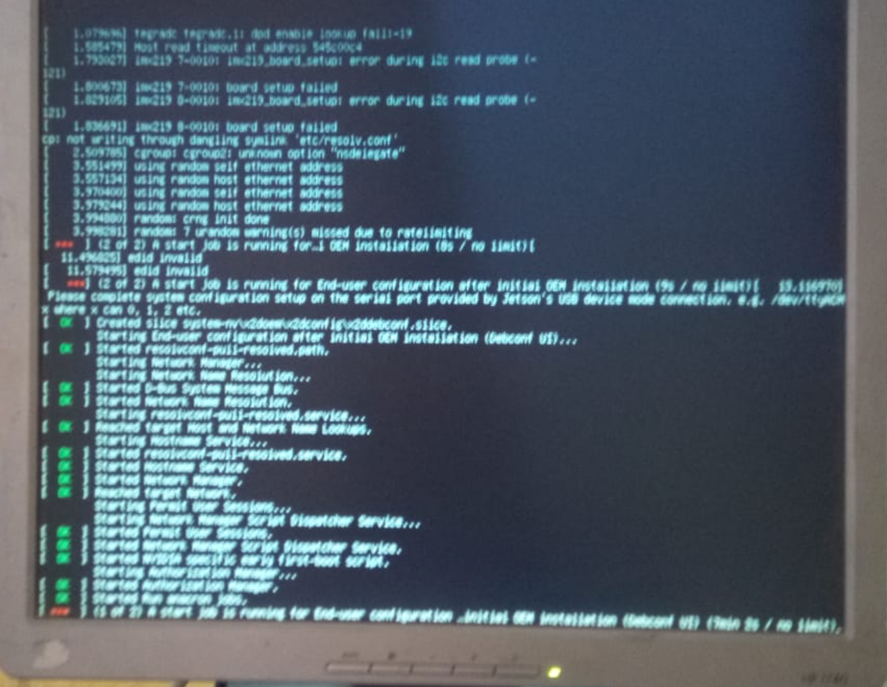
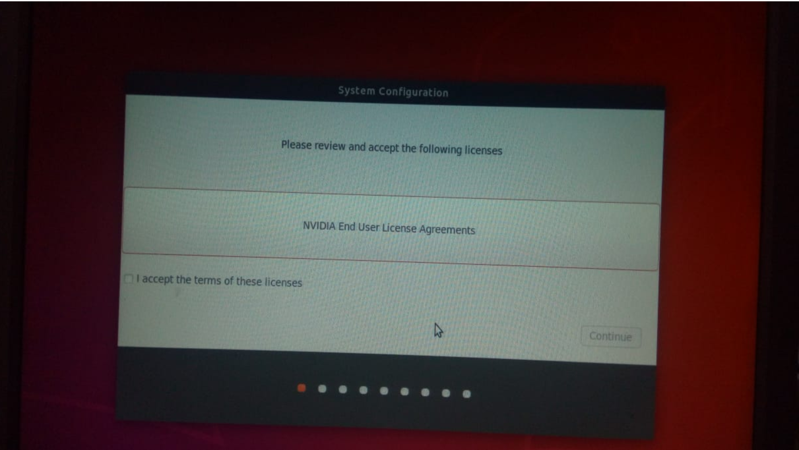
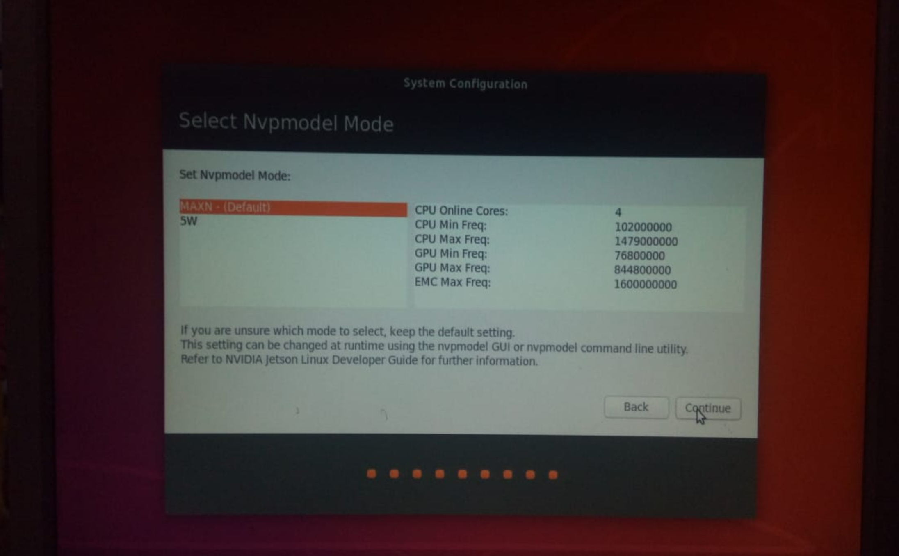
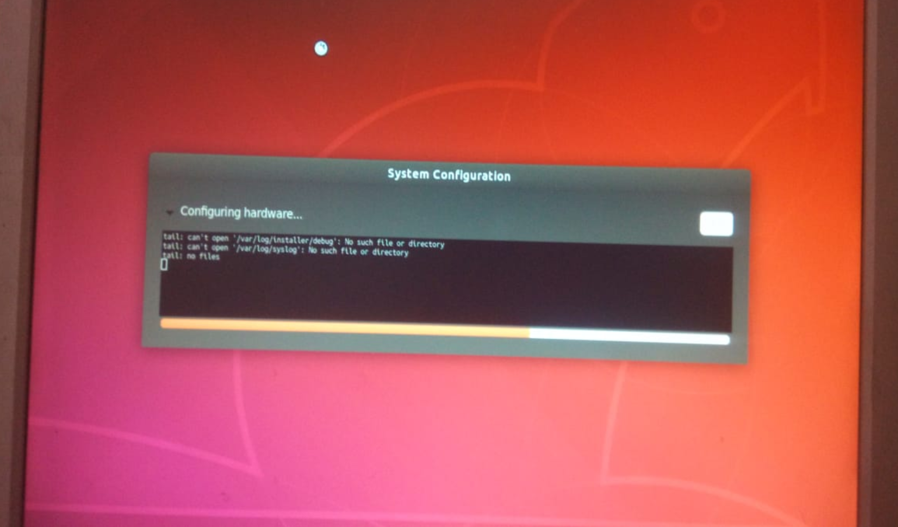
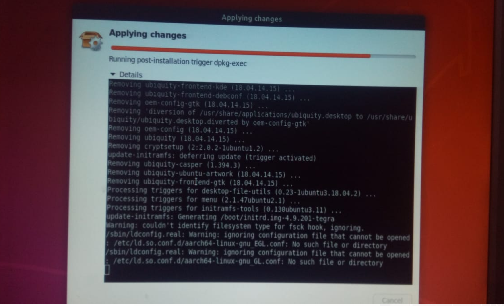
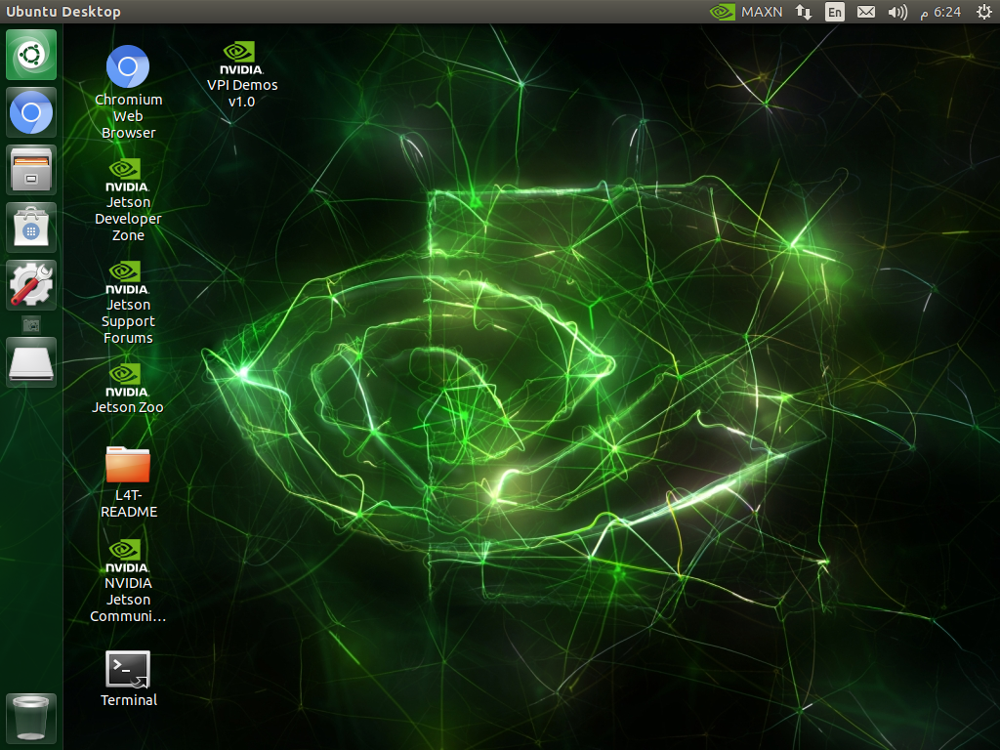

<!-- # Jetson Nano Guide for Absolute Beginners -->

---

???+ info inline end 
    This guide is typically for NVIDIA Jetson Nano Developer Kit 4GB

???+ info inline end
    Jetson Nano is a small and powerful micro-computer for AI and IoT applications

## Pre-install

Prior to installing your Nano, you need to prepare a few things first.
### Physical Components

- [x] Micro-SD, recommend 32 Gb at least
- [x] Adapter/Power Supply 5V/(2A at least) [ jack or micro-usb type b ]
- [x] Monitor
- [x] Mouse & Keyboard or remote control keyboard
- [x] SD-card reader
- [ ] HDMI to VGA if your monitor doesn't support HDMI (optional)

???+ tip
    For future use, with heavy load, it is recommended to use the jack power (5V - 4A)

???+ tip
    You may use your mobile charger for the setup, if it meets the minimum requirements (5V and >= 2A)

???+ Danger
     Never use a higher voltage than recommended. However, it is generally safe to use a power supply with a higher current rating than required.

## Software Components
- [x] OS image (you can find it [here](https://developer.nvidia.com/embedded/learn/get-started-jetson-nano-devkit#write))
- [ ] Prior Knowledge of Linux (optional)

## Burn the OS Image

We have two different options available: either via the command line (which I prefer) or through Etcher.

### Etcher

<!-- fix here and stackoverflow -->

Etcher is well-explained [here](https://www.youtube.com/watch?v=cf30ZQWauI8) (I recommend watching this)

### Command Line

- Check device name by inserting the SD-card and typing `sudo fdisk -l` in your terminal
- Now, eject the device and observe which device is no longer available (which will be the SD card, obviously).
- Unmount the partitions by `sudo umount <device-name>`
- `sudo dd bs=1M if=your_image_file_name.img of=/dev/<device-name>`

???+ Note
    I tried to use my mobile phone as a reader; however, it did not work. Therefore, please ensure that you have a compatible reader for the task. (In my case, I had to purchase one.)

## The Real Installation

1. Insert your SD card into your Jetson Nano's slot, which can be a bit tricky.
2.Connect any necessary peripherals, such as a keyboard, mouse, and monitor.
3. Plug the power, and voila

{ loading=lazy }

???+ Tip

    I am using a [wireless mini keyboard](https://www.amazon.com/Keyboard-Rii-Portable-Controller-Rechargeable/dp/B07D2BG6R5/ref=sr_1_3?keywords=mini+wireless+keyboard&qid=1690128922&sr=8-3) to reduce the power load on my Jetson Nano.

1. You should observe that the operating system is booting up. Please wait until the welcome page appears.

{ loading=lazy }

 

???+ Tip
    Please note that the setup process may take a long time (over 3 hours). If necessary, you may need to reboot the device and restart the setup.

1. Once this is done, simply select the default parameters and allow the setup to run automatically.

{ loading=lazy }
{ loading=lazy }
{ loading=lazy }
{ loading=lazy }

Finally, the setup will prompt you to restart the device. Please restart the device.
{ loading=lazy }
