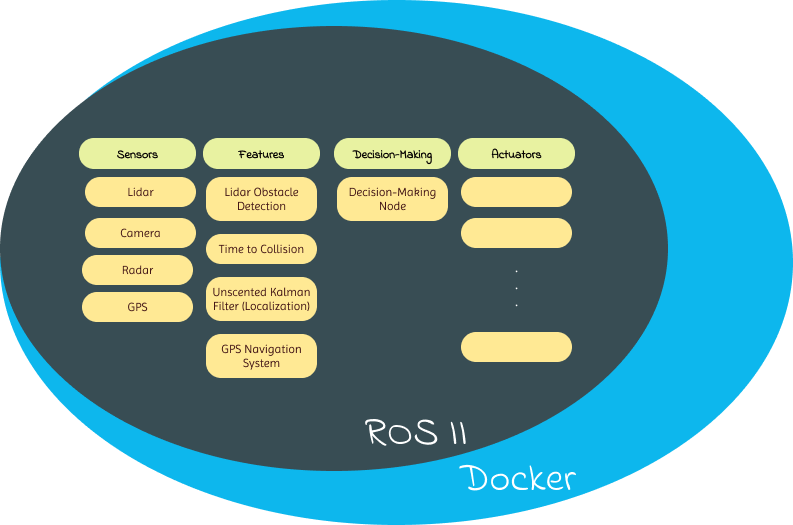

# Project Structure

---

{ loading=lazy }

The project is a modular system targeting ADAS level 3 allowing for the addition or extension of nodes and features based on specific requirements.

The current features include obstacle detection, time-to-collision analysis, Google Maps GPS integration, and Kalman filtering for sensor data fusion between lidar and radar.[^1]

[^1]: The concepts of time-to-collision analysis, obstacle detection, and Kalman filtering were inspired by {==Udacity==}, but GPS navigation system and the integration of these concepts with the ROS system was developed independently by the project team.

<!-- ???+ note inline end 
    \*  -->

Each feature is encapsulated within a ROS (Robot Operating System) node, which can be executed simultaneously and work in coordination with one another.

Each sensor is represented by a separate node that retrieves data either from the surrounding environment or from a simulator.

To test the functionality of the nodes, a simulator like Carla should be employed, provided that the necessary drivers for sensors are available. This is why careful consideration was given to sensor selection.

???+ tip
    check [ROS 2 integration with Carla](https://carla.readthedocs.io/projects/ros-bridge/en/latest/ros_installation_ros2/)

To ensure reliability and consistency across different environments, Docker was used.

A separate node, typically referred to as the decision-making node, is responsible for processing the data from all the enabled feature nodes. It analyzes the combined information and uses algorithms and rules to make decisions about the vehicle's actions, such as accelerating, braking, or steering.

By separating the feature nodes from the decision-making node, the system is designed to be more modular and flexible. This allows for easy customization of the decision-making process and the addition or removal of features as needed.

Actuator nodes part is not implemented. These nodes should coordinate with the decision-making process, where the decision-making node calls the corresponding actuator to execute the appropriate action.